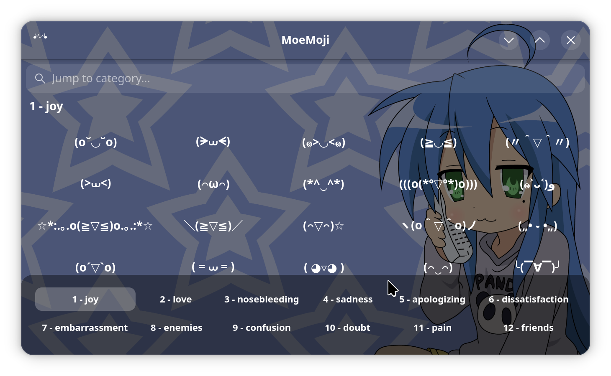
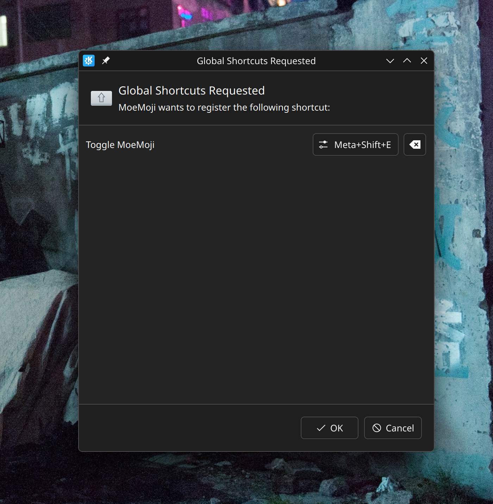

# MoeMoji  
Kaomoji picker. Browse a library of Japanese emoticons, click to copy, add your own!

  
  
## Install  
1. Download .flatpak file from Releases: https://gitea.angeltech.jp/Angel-Technologies/MoeMoji/releases/
2. Install with `flatpak install ./moemoji.flatpak`   

## Global shortcut  
This app uses global shortcut (Meta+Shift+E) for easy access. Press once to show the window, press twice to hide the window.  

App starts minimized by default and is hidden to the system tray; by design you are expected to press Meta+Shift+E to invoke the window, copy the emoticon and hide the window with the same shortcut, so it doesn't get in your way.  

If you use KDE like me, you will be requested with global shortcut access on app launch. You can remap this shortcut to anything you want and later you can edit this shortcut from system settings.  



## Add custom kaomojis / ASCII / anything  
All kaomojis are stored in a simple, accessible format:  
```
  data/kaomoji/
  ├── angry/
  │   ├── 001.txt
  │   ├── 002.txt
  │   ...
  ├── happy/
  │   ├── 001.txt
  │   ...
```  

To add your own category/emoticon, simply create a folder and a corresponding .txt file in either `$XDG_DATA_HOME/moemoji/kaomoji/` or `/usr/local/share/moemoji`.  

If you use flatpak, the correct data path is `~/.var/app/jp.angeltech.MoeMoji/data/`.  
So adding your own emoticons would look like this:  
1. `cd ~/.var/app/jp.angeltech.MoeMoji/data/`
2. `mkdir -p moemoji/kaomoji`
3. `cd moemoji/kaomoji`
4. `mkdir your-category`
5. `echo emoticon > your-category/001.txt`
6. relaunch app

You can add large ASCII text files or any text you want; the app handles multiline texts and displays a neat little preview.  
  
# Build  
  
`meson setup builddir`  
`ninja -C builddir`  
  
Run dev build: `GSETTINGS_SCHEMA_DIR=./builddir/data ./builddir/src/moemoji`  
  
# Flatpak packaging  
  
`flatpak-builder --force-clean --user --install .flatpak-build jp.angeltech.MoeMoji.json`  
`flatpak run jp.angeltech.MoeMoji`  

# Creating a distributable package

`flatpak-builder build/ jp.angeltech.MoeMoji.json`  
`flatpak build-export export build`  
`flatpak build-bundle export moemoji.flatpak jp.angeltech.MoeMoji.json`  

## Local manifest  

If you want to test local changes to the source code, you should build with `dev.jp.angeltech.MoeMoji.json` manifest instead, as main manifest pulls a tarball from the remote source.  

